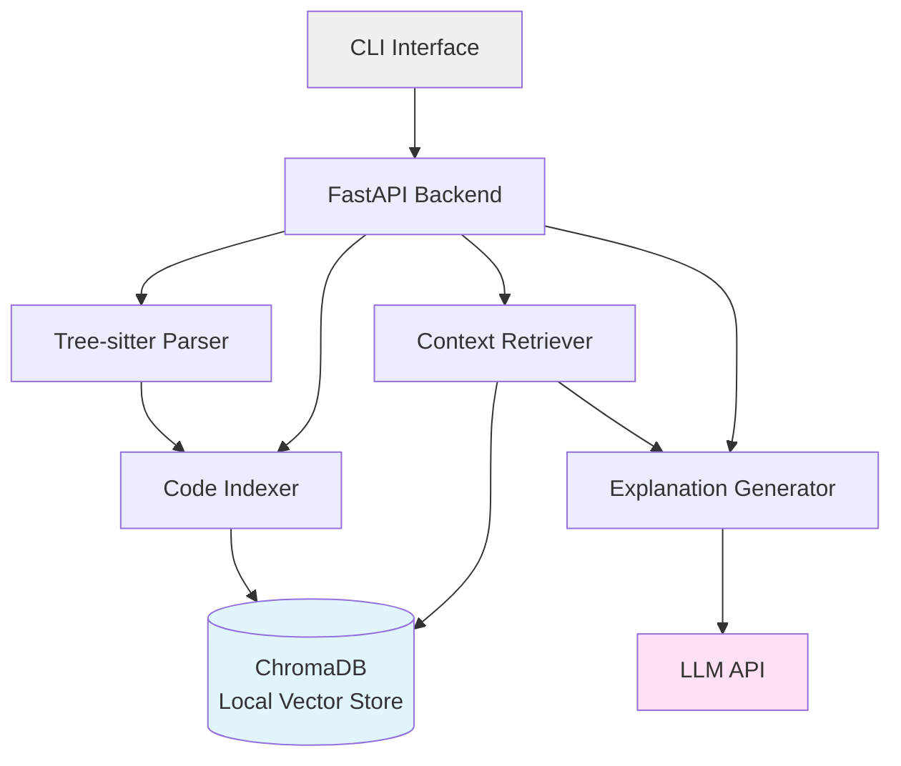
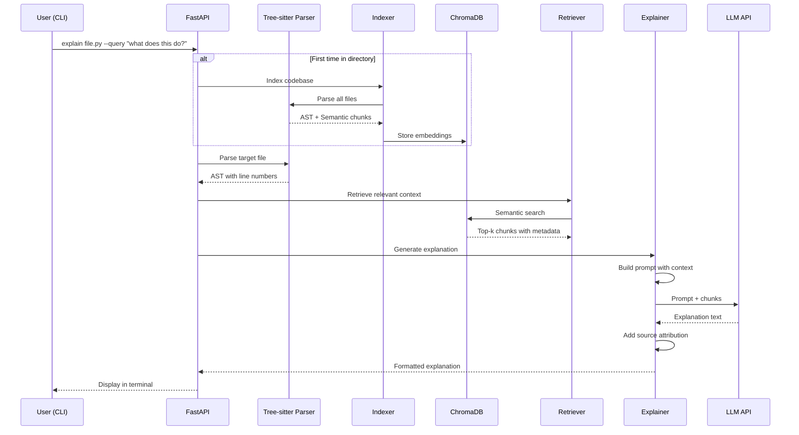
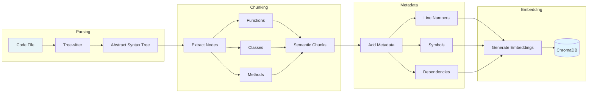

# Design Document: AI Learning Developer Productivity (Success-Focused Prototype)

## Overview

This is a success-focused prototype: a CLI tool that provides context-aware code explanations using local RAG (Retrieval-Augmented Generation) architecture. The system uses Tree-sitter for semantic code parsing, ChromaDB for local vector storage, and FastAPI for the backend service layer.

The tool helps developers understand code files in their current directory by generating AI-powered explanations with precise source attribution (line numbers). All processing happens locally to ensure privacy and offline capability.

### Key Design Principles

1. **Local-First**: All code indexing and storage happens locally, no external services required
2. **Semantic Understanding**: Use Tree-sitter to parse code structure, not just text
3. **Source Attribution**: Every explanation cites specific line numbers for verification
4. **Simple CLI**: Single command to explain any file in the current directory
5. **Fast Retrieval**: ChromaDB provides efficient semantic search over code chunks

## Architecture

### High-Level Architecture



### Data Flow: File Explanation Request



### Tree-sitter Semantic Chunking Pipeline



## Components and Interfaces

### Technology Stack

- **Backend**: FastAPI (Python) for REST API
- **Code Parsing**: Tree-sitter with language-specific grammars
- **Vector Database**: ChromaDB (local, persistent)
- **Embeddings**: OpenAI text-embedding-3-small or local model (sentence-transformers)
- **LLM**: OpenAI GPT-4 or compatible API
- **CLI**: Click (Python CLI framework)

### 1. CLI Interface

**Responsibility**: Command-line interface for user interaction

```python
# CLI commands
@click.group()
def cli():
    """AI-powered code explanation tool"""
    pass

@cli.command()
@click.argument('file_path', type=click.Path(exists=True))
@click.option('--query', '-q', help='Specific question about the code')
@click.option('--verbose', '-v', is_flag=True, help='Show detailed output')
def explain(file_path: str, query: Optional[str], verbose: bool):
    """Explain a code file with AI-powered analysis"""
    pass

@cli.command()
@click.option('--force', '-f', is_flag=True, help='Force re-indexing')
def index(force: bool):
    """Index the current directory's codebase"""
    pass

@cli.command()
def status():
    """Show indexing status and statistics"""
    pass
```

**Implementation Notes**:
- Uses Click for argument parsing and help text
- Validates file paths and displays clear error messages
- Formats output with syntax highlighting using Rich library
- Supports piping output for integration with other tools

### 2. FastAPI Backend

**Responsibility**: REST API for code explanation and indexing

```python
from fastapi import FastAPI, HTTPException
from pydantic import BaseModel

app = FastAPI(title="Code Explainer API")

class ExplainRequest(BaseModel):
    file_path: str
    query: Optional[str] = None
    max_context_chunks: int = 5

class ExplainResponse(BaseModel):
    explanation: str
    source_attributions: List[SourceAttribution]
    context_used: List[str]
    metadata: ResponseMetadata

class IndexRequest(BaseModel):
    directory_path: str
    force_reindex: bool = False
    file_patterns: List[str] = ["*.py", "*.js", "*.ts", "*.java", "*.go", "*.rs"]

class IndexResponse(BaseModel):
    files_indexed: int
    chunks_created: int
    time_taken: float
    status: str

@app.post("/explain", response_model=ExplainResponse)
async def explain_code(request: ExplainRequest):
    """Generate explanation for a code file"""
    pass

@app.post("/index", response_model=IndexResponse)
async def index_codebase(request: IndexRequest):
    """Index codebase for semantic search"""
    pass

@app.get("/status")
async def get_status():
    """Get indexing status and statistics"""
    pass
```

**Implementation Notes**:
- FastAPI provides automatic OpenAPI documentation
- Pydantic models ensure type safety and validation
- Async endpoints for better performance
- CORS enabled for potential web UI in future

### 3. Tree-sitter Parser

**Responsibility**: Parse code files into semantic chunks with AST

```python
from tree_sitter import Language, Parser
from typing import List, Dict, Any

class TreeSitterParser:
    def __init__(self):
        self.parsers: Dict[str, Parser] = {}
        self._load_languages()
    
    def _load_languages(self):
        """Load Tree-sitter grammars for supported languages"""
        languages = {
            'python': Language('build/languages.so', 'python'),
            'javascript': Language('build/languages.so', 'javascript'),
            'typescript': Language('build/languages.so', 'typescript'),
            'java': Language('build/languages.so', 'java'),
            'go': Language('build/languages.so', 'go'),
            'rust': Language('build/languages.so', 'rust'),
        }
        for lang, grammar in languages.items():
            parser = Parser()
            parser.set_language(grammar)
            self.parsers[lang] = parser
    
    def parse_file(self, file_path: str, content: str) -> ParseResult:
        """Parse a file and return AST with metadata"""
        pass
    
    def extract_semantic_chunks(self, tree: Tree, content: str) -> List[SemanticChunk]:
        """Extract functions, classes, methods from AST"""
        pass
    
    def get_node_text(self, node: Node, content: bytes) -> str:
        """Extract text for a specific AST node"""
        pass

class ParseResult:
    tree: Tree
    language: str
    chunks: List[SemanticChunk]
    symbols: List[Symbol]
    imports: List[Import]

class SemanticChunk:
    chunk_type: str  # 'function', 'class', 'method', 'block'
    name: str
    content: str
    start_line: int
    end_line: int
    start_byte: int
    end_byte: int
    parent: Optional[str]  # Parent class for methods
    docstring: Optional[str]
    parameters: List[Parameter]
    return_type: Optional[str]
    dependencies: List[str]  # Other symbols referenced

class Symbol:
    name: str
    type: str  # 'function', 'class', 'variable', 'import'
    line: int
    scope: str

class Parameter:
    name: str
    type_annotation: Optional[str]
    default_value: Optional[str]
```

**Implementation Notes**:
- Tree-sitter provides language-agnostic parsing
- Extracts semantic units (functions, classes) not arbitrary text blocks
- Preserves line numbers for source attribution
- Identifies dependencies between code elements
- Handles syntax errors gracefully

### 4. Code Indexer

**Responsibility**: Index codebase and store embeddings in ChromaDB

```python
from chromadb import Client, Collection
from chromadb.config import Settings
import hashlib

class CodeIndexer:
    def __init__(self, persist_directory: str = "./.code_index"):
        self.client = Client(Settings(
            chroma_db_impl="duckdb+parquet",
            persist_directory=persist_directory
        ))
        self.collection: Collection = None
        self.parser = TreeSitterParser()
        self.embedding_function = self._get_embedding_function()
    
    def _get_embedding_function(self):
        """Get embedding function (OpenAI or local)"""
        pass
    
    def index_directory(self, directory: str, force: bool = False) -> IndexStats:
        """Index all supported files in directory"""
        pass
    
    def index_file(self, file_path: str) -> List[str]:
        """Index a single file, return chunk IDs"""
        pass
    
    def _should_reindex(self, file_path: str, file_hash: str) -> bool:
        """Check if file needs reindexing based on hash"""
        pass
    
    def _create_chunk_embedding(self, chunk: SemanticChunk) -> List[float]:
        """Generate embedding for a semantic chunk"""
        pass
    
    def _store_chunks(self, chunks: List[SemanticChunk], file_path: str):
        """Store chunks with embeddings in ChromaDB"""
        pass

class IndexStats:
    files_processed: int
    files_skipped: int
    chunks_created: int
    chunks_updated: int
    errors: List[IndexError]
    time_taken: float
```

**Implementation Notes**:
- Uses file hashes to detect changes and avoid re-indexing
- Stores chunks with rich metadata (file path, line numbers, type)
- Batches embedding generation for efficiency
- Persists ChromaDB to disk for reuse
- Handles parsing errors without stopping entire index

### 5. Context Retriever

**Responsibility**: Retrieve relevant code chunks for explanation

```python
class ContextRetriever:
    def __init__(self, collection: Collection):
        self.collection = collection
    
    def retrieve_context(
        self,
        query: str,
        target_file: str,
        max_chunks: int = 5,
        include_target_file: bool = True
    ) -> RetrievedContext:
        """Retrieve relevant chunks for explanation"""
        pass
    
    def _semantic_search(self, query: str, n_results: int) -> List[ChunkResult]:
        """Perform semantic similarity search"""
        pass
    
    def _get_file_chunks(self, file_path: str) -> List[ChunkResult]:
        """Get all chunks from a specific file"""
        pass
    
    def _rank_chunks(self, chunks: List[ChunkResult], query: str) -> List[ChunkResult]:
        """Re-rank chunks by relevance"""
        pass
    
    def _deduplicate_chunks(self, chunks: List[ChunkResult]) -> List[ChunkResult]:
        """Remove duplicate or overlapping chunks"""
        pass

class RetrievedContext:
    chunks: List[ChunkResult]
    total_tokens: int
    files_referenced: List[str]
    
class ChunkResult:
    chunk: SemanticChunk
    similarity_score: float
    file_path: str
    metadata: Dict[str, Any]
```

**Implementation Notes**:
- Combines semantic search with file-specific retrieval
- Always includes chunks from the target file
- Re-ranks results to prioritize most relevant
- Manages token budget to stay within LLM limits
- Deduplicates overlapping chunks

### 6. Explanation Generator

**Responsibility**: Generate explanations using LLM with retrieved context

```python
from openai import OpenAI

class ExplanationGenerator:
    def __init__(self, api_key: str, model: str = "gpt-4"):
        self.client = OpenAI(api_key=api_key)
        self.model = model
    
    def generate_explanation(
        self,
        file_path: str,
        file_content: str,
        context: RetrievedContext,
        query: Optional[str] = None
    ) -> Explanation:
        """Generate explanation with source attribution"""
        pass
    
    def _build_prompt(
        self,
        file_path: str,
        file_content: str,
        context: RetrievedContext,
        query: Optional[str]
    ) -> str:
        """Build prompt with context and instructions"""
        pass
    
    def _extract_source_attributions(self, explanation_text: str) -> List[SourceAttribution]:
        """Parse line number references from explanation"""
        pass
    
    def _format_explanation(self, raw_text: str) -> str:
        """Format explanation with markdown and syntax highlighting"""
        pass

class Explanation:
    text: str
    source_attributions: List[SourceAttribution]
    context_files: List[str]
    metadata: ExplanationMetadata

class SourceAttribution:
    file_path: str
    line_number: int
    line_range: Optional[Tuple[int, int]]
    snippet: str
    context: str  # What this reference is about

class ExplanationMetadata:
    model_used: str
    tokens_used: int
    context_chunks: int
    generation_time: float
```

**Implementation Notes**:
- Builds structured prompts with clear instructions for source attribution
- Includes retrieved context with line numbers
- Instructs LLM to cite line numbers in format "Line X" or "Lines X-Y"
- Parses response to extract and validate source attributions
- Formats output with syntax highlighting for terminal display

## Data Models

### Core Data Structures

```python
from dataclasses import dataclass
from typing import List, Optional, Dict, Any
from datetime import datetime

# Semantic Chunks
@dataclass
class SemanticChunk:
    """A meaningful unit of code extracted from AST"""
    chunk_id: str
    chunk_type: str  # 'function', 'class', 'method', 'block'
    name: str
    content: str
    file_path: str
    start_line: int
    end_line: int
    language: str
    parent: Optional[str] = None  # Parent class for methods
    docstring: Optional[str] = None
    parameters: List['Parameter'] = None
    return_type: Optional[str] = None
    dependencies: List[str] = None  # Referenced symbols
    complexity: Optional[int] = None  # Cyclomatic complexity

@dataclass
class Parameter:
    """Function/method parameter"""
    name: str
    type_annotation: Optional[str] = None
    default_value: Optional[str] = None

# Source Attribution
@dataclass
class SourceAttribution:
    """Reference to specific code location"""
    file_path: str
    line_number: int
    line_range: Optional[tuple[int, int]] = None
    snippet: str
    context: str  # What this reference is about

# Explanation
@dataclass
class Explanation:
    """Generated code explanation"""
    text: str
    source_attributions: List[SourceAttribution]
    context_files: List[str]
    metadata: 'ExplanationMetadata'

@dataclass
class ExplanationMetadata:
    """Metadata about explanation generation"""
    model_used: str
    tokens_used: int
    context_chunks: int
    generation_time: float
    timestamp: datetime

# Context Retrieval
@dataclass
class RetrievedContext:
    """Context retrieved for explanation"""
    chunks: List['ChunkResult']
    total_tokens: int
    files_referenced: List[str]

@dataclass
class ChunkResult:
    """A chunk with similarity score"""
    chunk: SemanticChunk
    similarity_score: float
    metadata: Dict[str, Any]

# Indexing
@dataclass
class IndexStats:
    """Statistics from indexing operation"""
    files_processed: int
    files_skipped: int
    chunks_created: int
    chunks_updated: int
    errors: List['IndexError']
    time_taken: float

@dataclass
class IndexError:
    """Error during indexing"""
    file_path: str
    error_type: str
    message: str
    line_number: Optional[int] = None

# Parse Results
@dataclass
class ParseResult:
    """Result of parsing a file"""
    file_path: str
    language: str
    chunks: List[SemanticChunk]
    symbols: List['Symbol']
    imports: List['Import']
    parse_errors: List[str]

@dataclass
class Symbol:
    """A symbol (function, class, variable) in code"""
    name: str
    type: str  # 'function', 'class', 'variable', 'import'
    line: int
    scope: str
    definition: Optional[str] = None

@dataclass
class Import:
    """An import statement"""
    module: str
    names: List[str]
    alias: Optional[str] = None
    line: int
```

### ChromaDB Schema

```python
# Collection: code_chunks
# Stores semantic chunks with embeddings

chunk_document = {
    "id": "uuid-string",
    "document": "function calculate_total(items: List[Item]) -> float:\n    ...",
    "embedding": [0.1, 0.2, ...],  # Generated by embedding model
    "metadata": {
        "file_path": "src/calculator.py",
        "chunk_type": "function",
        "name": "calculate_total",
        "start_line": 45,
        "end_line": 52,
        "language": "python",
        "parent": None,
        "has_docstring": True,
        "parameters": ["items"],
        "return_type": "float",
        "dependencies": ["Item", "sum"],
        "complexity": 3,
        "file_hash": "abc123...",
        "indexed_at": "2024-01-15T10:30:00Z"
    }
}

# Collection: file_metadata
# Tracks indexed files and their hashes

file_document = {
    "id": "file-path-hash",
    "document": "src/calculator.py",
    "metadata": {
        "file_path": "src/calculator.py",
        "file_hash": "abc123...",
        "language": "python",
        "chunk_count": 12,
        "last_indexed": "2024-01-15T10:30:00Z",
        "file_size": 4096,
        "line_count": 150
    }
}
```


## Correctness Properties

*A property is a characteristic or behavior that should hold true across all valid executions of a system—essentially, a formal statement about what the system should do. Properties serve as the bridge between human-readable specifications and machine-verifiable correctness guarantees.*

### CLI Interface Properties

**Property 1: File paths load and process correctly**
*For any* valid file path provided to the CLI, the system should successfully load and process that file.
**Validates: Requirements 1.1**

**Property 2: Query parameters are accepted**
*For any* query string provided via the --query parameter, the CLI should accept it and pass it to the explanation generator.
**Validates: Requirements 1.3**

**Property 3: Explanations are formatted for terminal**
*For any* generated explanation, the output should be formatted with proper line breaks, syntax highlighting, and readable structure.
**Validates: Requirements 1.4**

### Context-Aware Explanation Properties

**Property 4: Tree-sitter parses code semantically**
*For any* supported code file, parsing with Tree-sitter should produce an abstract syntax tree with identifiable nodes for functions, classes, and methods.
**Validates: Requirements 2.1, 4.1**

**Property 5: Semantic elements are identified**
*For any* code file containing functions or classes, the parser should identify and extract those elements with their names and locations.
**Validates: Requirements 2.2**

**Property 6: Context is used in explanation generation**
*For any* explanation request, the retrieved context chunks should be included in the prompt sent to the LLM.
**Validates: Requirements 2.3**

**Property 7: Query focuses explanation**
*For any* explanation request with a query, the explanation should contain terms or concepts from the query, indicating relevance.
**Validates: Requirements 2.5**

### Source Attribution Properties

**Property 8: Line numbers included in explanations**
*For any* code reference in an explanation, it should include a line number in the format "Line X" or "Lines X-Y".
**Validates: Requirements 3.1, 3.4**

**Property 9: Function and class definitions cited**
*For any* function or class mentioned in an explanation, the line number where it is defined should be cited.
**Validates: Requirements 3.2**

**Property 10: All code references have attribution**
*For any* explanation discussing multiple code elements, each element should have associated source attribution with line numbers.
**Validates: Requirements 3.3, 3.5**

### Semantic Chunking Properties

**Property 11: Chunks align with semantic boundaries**
*For any* code file, the created chunks should correspond to complete functions, classes, or methods, not arbitrary text splits.
**Validates: Requirements 4.2**

**Property 12: Chunks preserve context and dependencies**
*For any* semantic chunk, it should include metadata about its scope, parent (if a method), and dependencies on other code elements.
**Validates: Requirements 4.3, 4.4**

### Local RAG Properties

**Property 13: Embeddings stored locally**
*For any* indexed code chunk, its embedding should be stored in the local ChromaDB instance, not sent to external services.
**Validates: Requirements 5.3**

**Property 14: Retrieval queries local store**
*For any* context retrieval request, the query should be executed against the local ChromaDB instance.
**Validates: Requirements 5.4**

**Property 15: Vector store persists across sessions**
*For any* indexed codebase, stopping and restarting the system should preserve the index without re-indexing unchanged files.
**Validates: Requirements 5.5**

### Code Indexing Properties

**Property 16: All supported files indexed**
*For any* directory containing supported code files, running the index command should process all files with supported extensions.
**Validates: Requirements 6.1**

**Property 17: Chunks have embeddings**
*For any* semantic chunk created during indexing, it should have an associated embedding vector.
**Validates: Requirements 6.3**

**Property 18: Chunks have required metadata**
*For any* stored semantic chunk, it should have metadata including file_path, start_line, end_line, and chunk_type.
**Validates: Requirements 6.4**

**Property 19: Unchanged files skipped on re-index**
*For any* file that has not changed since the last index (same hash), re-indexing should skip that file.
**Validates: Requirements 6.5**

### Context Retrieval Properties

**Property 20: Relevant chunks retrieved**
*For any* explanation request, the system should retrieve semantic chunks from the vector store.
**Validates: Requirements 7.1**

**Property 21: Similarity search used**
*For any* retrieval operation, chunks should be ranked by semantic similarity scores.
**Validates: Requirements 7.2**

**Property 22: Configurable top-k retrieval**
*For any* retrieval operation, the number of chunks returned should match the configured top-k value (default 5).
**Validates: Requirements 7.3**

**Property 23: Query improves retrieval**
*For any* two retrieval operations on the same file (one with query, one without), the query-based retrieval should return different or re-ranked results.
**Validates: Requirements 7.4**

**Property 24: Target file chunks always included**
*For any* explanation request for a specific file, at least one chunk from that target file should be in the retrieved context.
**Validates: Requirements 7.5**

### Explanation Generation Properties

**Property 25: Context and query in prompt**
*For any* explanation generation, the prompt sent to the LLM should contain both the retrieved context chunks and the user's query (if provided).
**Validates: Requirements 8.1**

**Property 26: LLM used for generation**
*For any* explanation request, the system should make an API call to the configured LLM.
**Validates: Requirements 8.2**

**Property 27: Explanations have structure**
*For any* generated explanation, it should contain identifiable sections such as overview, details, and insights.
**Validates: Requirements 8.3**

**Property 28: Function explanations cover key elements**
*For any* explanation of a function, it should mention parameters, return values, or side effects.
**Validates: Requirements 8.4**

**Property 29: Class explanations cover key elements**
*For any* explanation of a class, it should mention the class purpose, methods, or relationships to other classes.
**Validates: Requirements 8.5**

### Multi-Language Support Properties

**Property 30: Language auto-detected**
*For any* code file with a recognized extension, the system should correctly identify its programming language.
**Validates: Requirements 9.2**

**Property 31: Correct grammar used**
*For any* parsed file, the Tree-sitter parser should use the grammar corresponding to the detected language.
**Validates: Requirements 9.3**

### Error Handling Properties

**Property 32: LLM failures trigger retry**
*For any* LLM API failure, the system should retry the request with exponential backoff up to 3 times.
**Validates: Requirements 10.3**

## Error Handling

### Error Categories and Handling Strategies

```python
from enum import Enum
from dataclasses import dataclass
from typing import Optional

class ErrorCategory(Enum):
    PARSE_ERROR = "parse_error"
    FILE_NOT_FOUND = "file_not_found"
    UNSUPPORTED_LANGUAGE = "unsupported_language"
    VECTOR_DB_ERROR = "vector_db_error"
    LLM_API_ERROR = "llm_api_error"
    EMBEDDING_ERROR = "embedding_error"
    INDEXING_ERROR = "indexing_error"
    INVALID_INPUT = "invalid_input"

@dataclass
class SystemError:
    category: ErrorCategory
    message: str
    file_path: Optional[str] = None
    line_number: Optional[int] = None
    original_error: Optional[Exception] = None
    recoverable: bool = True

@dataclass
class ErrorResponse:
    user_message: str
    suggested_action: Optional[str] = None
    technical_details: Optional[str] = None
    exit_code: int = 1
```

### Error Handling Strategies

**Parse Errors**:
- Display the file path and line number where parsing failed
- Show the problematic code snippet if available
- Suggest checking syntax or file encoding
- Continue indexing other files (don't fail entire operation)
- User message: "Failed to parse {file}: syntax error at line {line}"

**File Not Found**:
- Validate file paths before processing
- Display clear error with the attempted path
- Suggest checking file name and current directory
- Exit with code 1
- User message: "File not found: {path}. Check the file path and try again."

**Unsupported Language**:
- Detect language from file extension
- List supported languages in error message
- Suggest using a supported file
- Exit with code 1
- User message: "Unsupported language: {lang}. Supported: Python, JavaScript, TypeScript, Java, Go, Rust"

**Vector Database Errors**:
- Retry connection errors (3 attempts with exponential backoff)
- Check if ChromaDB directory is writable
- Suggest checking disk space and permissions
- Fall back to re-indexing if corruption detected
- User message: "Database error: {error}. Try running 'index --force' to rebuild."

**LLM API Errors**:
- Retry transient errors (network, timeout) with exponential backoff (3 attempts)
- Check API key configuration on authentication errors
- Display rate limit information if applicable
- Suggest checking API configuration
- User message: "LLM API error: {error}. Check your API key and network connection."

**Embedding Errors**:
- Retry embedding generation failures
- Fall back to simpler embedding model if available
- Skip problematic chunks and continue
- Log errors for debugging
- User message: "Failed to generate embeddings for some code chunks. Continuing with available data."

**Indexing Errors**:
- Continue indexing other files on individual file failures
- Collect all errors and display summary at end
- Suggest re-running with --verbose for details
- Don't fail entire index operation for single file errors
- User message: "Indexed {success} files with {errors} errors. Run with --verbose for details."

**Invalid Input**:
- Validate CLI arguments before processing
- Display usage help for invalid arguments
- Suggest correct argument format
- Exit with code 2
- User message: "Invalid argument: {arg}. Run with --help for usage information."

### Retry Logic

```python
import time
from typing import Callable, TypeVar, Optional

T = TypeVar('T')

def retry_with_backoff(
    func: Callable[[], T],
    max_attempts: int = 3,
    base_delay: float = 1.0,
    max_delay: float = 10.0,
    exponential_base: float = 2.0
) -> T:
    """Retry a function with exponential backoff"""
    for attempt in range(max_attempts):
        try:
            return func()
        except Exception as e:
            if attempt == max_attempts - 1:
                raise
            delay = min(base_delay * (exponential_base ** attempt), max_delay)
            time.sleep(delay)
```

## Testing Strategy

### Dual Testing Approach

This system requires both unit testing and property-based testing for comprehensive coverage:

**Unit Tests**: Focus on specific examples, edge cases, and integration points
- Test specific error conditions (malformed files, missing files, unsupported languages)
- Test Tree-sitter parsing for each supported language
- Test ChromaDB operations (store, retrieve, persist)
- Test CLI argument parsing and validation
- Test specific code examples (known functions, classes)
- Test edge cases (empty files, very large files, special characters)

**Property-Based Tests**: Verify universal properties across all inputs
- Test that all properties defined in the Correctness Properties section hold
- Use randomized code generation to test parsing robustness
- Verify invariants across different input combinations
- Test with generated file structures and queries

### Property-Based Testing Configuration

**Framework**: Use `Hypothesis` for Python property-based testing

**Configuration**:
- Minimum 100 iterations per property test
- Each test tagged with: `# Feature: ai-learning-developer-productivity, Property {N}: {property_text}`
- Use custom strategies for domain objects (SemanticChunk, ParseResult, etc.)

**Example Property Test Structure**:

```python
from hypothesis import given, strategies as st
import pytest

# Feature: ai-learning-developer-productivity, Property 4: Tree-sitter parses code semantically
@given(st.text(min_size=10, max_size=1000))
@pytest.mark.property_test
def test_tree_sitter_produces_ast(code_content):
    """For any supported code file, parsing should produce an AST"""
    parser = TreeSitterParser()
    # Create a valid Python file
    file_content = f"def test_func():\n    {code_content}\n    pass"
    
    result = parser.parse_file("test.py", file_content)
    
    assert result.tree is not None
    assert len(result.chunks) > 0
    assert all(chunk.start_line > 0 for chunk in result.chunks)

# Feature: ai-learning-developer-productivity, Property 8: Line numbers included in explanations
@given(st.text(min_size=1, max_size=100))
@pytest.mark.property_test
def test_explanations_include_line_numbers(query):
    """For any explanation, code references should include line numbers"""
    # Mock explanation generator
    explanation = generate_explanation("test.py", "def foo(): pass", query)
    
    # Check for line number format
    import re
    line_pattern = r'Line \d+|Lines \d+-\d+'
    assert re.search(line_pattern, explanation.text) is not None

# Feature: ai-learning-developer-productivity, Property 19: Unchanged files skipped on re-index
@given(st.lists(st.text(min_size=10, max_size=100), min_size=1, max_size=10))
@pytest.mark.property_test
def test_unchanged_files_skipped(file_contents):
    """For any unchanged file, re-indexing should skip it"""
    indexer = CodeIndexer()
    
    # First index
    stats1 = indexer.index_directory("test_dir")
    
    # Re-index without changes
    stats2 = indexer.index_directory("test_dir")
    
    assert stats2.files_skipped == stats1.files_processed
    assert stats2.chunks_created == 0
```

### Test Coverage Goals

- Unit test coverage: >80% for core logic
- Property test coverage: All 32 correctness properties
- Integration test coverage: CLI → API → Parser → DB → LLM flow
- End-to-end test coverage: Complete explain workflow

### Testing Tools

- **Unit Testing**: pytest
- **Property Testing**: Hypothesis
- **Mocking**: pytest-mock, responses (for HTTP mocking)
- **Code Quality**: black, flake8, mypy (type checking)
- **Coverage**: pytest-cov

### Test Data Generation

```python
from hypothesis import strategies as st

# Custom strategies for domain objects
@st.composite
def semantic_chunk_strategy(draw):
    """Generate random SemanticChunk objects"""
    return SemanticChunk(
        chunk_id=draw(st.uuids()).hex,
        chunk_type=draw(st.sampled_from(['function', 'class', 'method'])),
        name=draw(st.text(min_size=1, max_size=50)),
        content=draw(st.text(min_size=10, max_size=500)),
        file_path=draw(st.text(min_size=1, max_size=100)),
        start_line=draw(st.integers(min_value=1, max_value=1000)),
        end_line=draw(st.integers(min_value=1, max_value=1000)),
        language=draw(st.sampled_from(['python', 'javascript', 'typescript', 'java', 'go', 'rust']))
    )

@st.composite
def code_file_strategy(draw):
    """Generate random valid code files"""
    language = draw(st.sampled_from(['python', 'javascript', 'typescript']))
    
    if language == 'python':
        return f"def {draw(st.text(min_size=1, max_size=20))}():\n    pass"
    elif language == 'javascript':
        return f"function {draw(st.text(min_size=1, max_size=20))}() {{}}"
    else:  # typescript
        return f"function {draw(st.text(min_size=1, max_size=20))}(): void {{}}"
```

### Continuous Testing

- Run unit tests on every commit (CI/CD)
- Run property tests on PR and nightly builds
- Monitor test execution time and optimize slow tests
- Track flaky tests and fix root causes
- Maintain test documentation for complex scenarios
- Use test fixtures for common setups (sample codebases, mock LLM responses)
